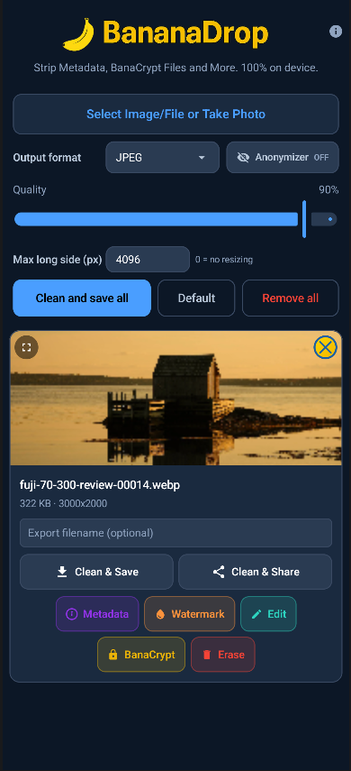
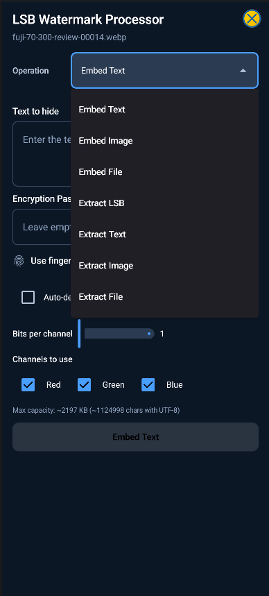
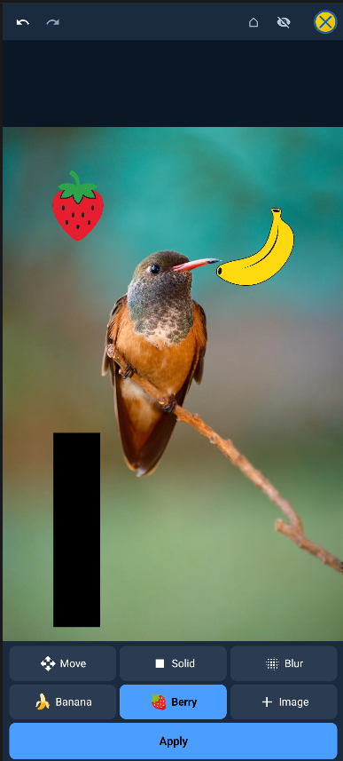
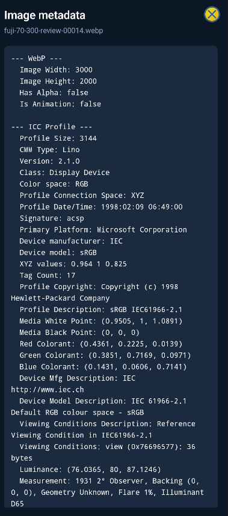



  
  

# BananaDrop 🍌

**Privacy-focused image tool — 100% on-device processing.**

BananaDrop is a mobile application for Android that gives you full control over your images and files. All processing happens on your device — zero network access, no data ever leaves your phone.

## Screenshots

  
  
  
  

## Features

### 🧹 Metadata Stripping
Remove EXIF, XMP, ICC profiles, and other metadata from images and PDFs. Supports **JPEG**, **PNG**, **WebP**, **BMP**, **TIFF**, **AVIF**, and **PDF**. The output is sanitized at the byte level — no hidden data survives.

### 💧 LSB Steganography (Watermark)
Hide text, images, or files inside ordinary images using **Least Significant Bit** encoding.
- Configurable bit planes and color channels (R/G/B)
- Optional encryption via **Argon2id** password or **biometric authentication** (fingerprint)
- Auto-delete container after extraction with configurable timer

### 🔐 BanaCrypt — File Encryption
Encrypt and decrypt any file using **XChaCha20-Poly1305** with **Argon2id** key derivation (via libsodium).
- Split large files into encrypted parts for sharing
- Reassemble and decrypt split files seamlessly
- Biometric-protected encryption keys

### 🗑️ Secure Erase
Permanently erase files with a **3-pass overwrite** algorithm (random → zeros → random) followed by truncation. Works on both local files and SAF documents. Files become unrecoverable.

### ✏️ Image Editor
Apply edits before saving: blur, overlay images, or redact sensitive areas with black rectangles before exporting a sanitized copy for privacy.

### 📄 PDF Support
- Render PDF pages as images
- Strip metadata from PDF documents
- Export images as PDF files
- Import PDF files for processing

## Permissions Required

| Permission | Purpose |
|---|---|
| READ_MEDIA_IMAGES / READ_EXTERNAL_STORAGE | Load images from gallery |
| CAMERA | Take photos for watermarking |
| Biometric | Fingerprint unlock for encryption |

The app never accesses the internet.

## Libraries

- **libsodium** (via Lazysodium) — Argon2id + XChaCha20-Poly1305 encryption
- **metadata-extractor** (Drewnoakes) — comprehensive metadata reading
- **avif-coder** — AVIF/HEIF software codec
- **Coil** — image loading
- **AndroidSVG** — SVG rendering
- **AndroidX** — UI framework (Compose, Navigation, Lifecycle)

## Download

[**Download the latest APK**](https://github.com/banalchemist/BananaDrop/releases/latest)

## License

Not open source yet — may become open source in the future. The APK is provided free of charge for personal use. Redistribution or modification is not permitted.

## Credits

Developed by [banalchemist](https://github.com/banalchemist).

